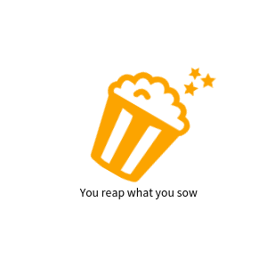

# Log Theater



## Description

Personal Blog.


[](https://www.ecma-international.org/)
[](https://nodejs.org/en/about/)
[](https://www.typescriptlang.org/)
[](https://github.com/facebook/react)
[](https://github.com/gatsbyjs/gatsby)
[](https://github.com/graphql/graphql-js)

[](https://github.com/prettier/prettier)
[](https://github.com/eslint/eslint)

[](https://editorconfig.org/)
[](https://docs.npmjs.com/about-npm)

## USAGE

Sorry, Not NPM Package.

- For Development

```
npm run develop
```

## License

- [MIT](./LICENSE)

### Include Library License Explain.

- [gatsby](https://github.com/gatsbyjs/gatsby/blob/master/LICENSE)

- [react](https://github.com/facebook/react/blob/main/LICENSE)

### Author

[](https://twitter.com/onesword0618)
