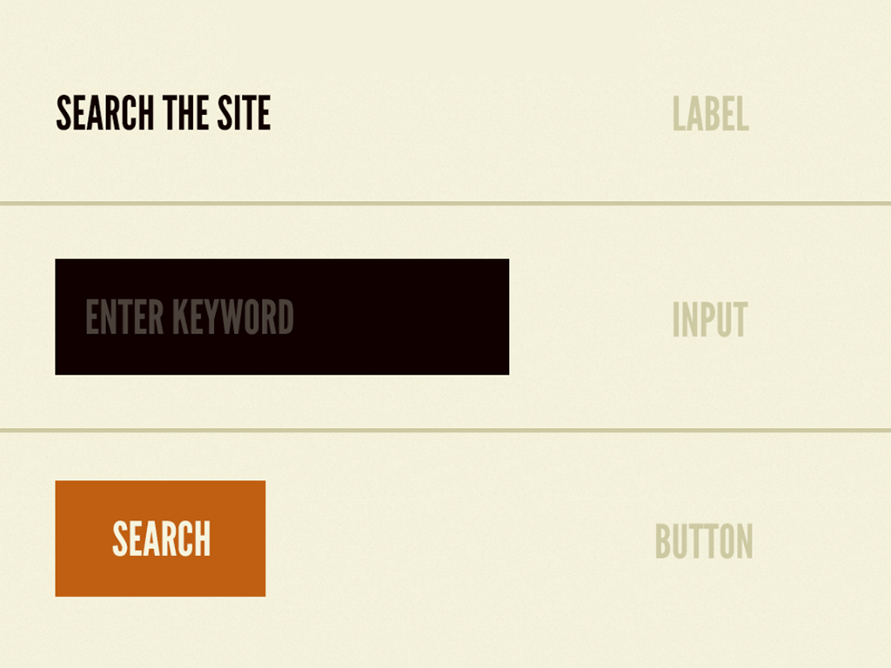
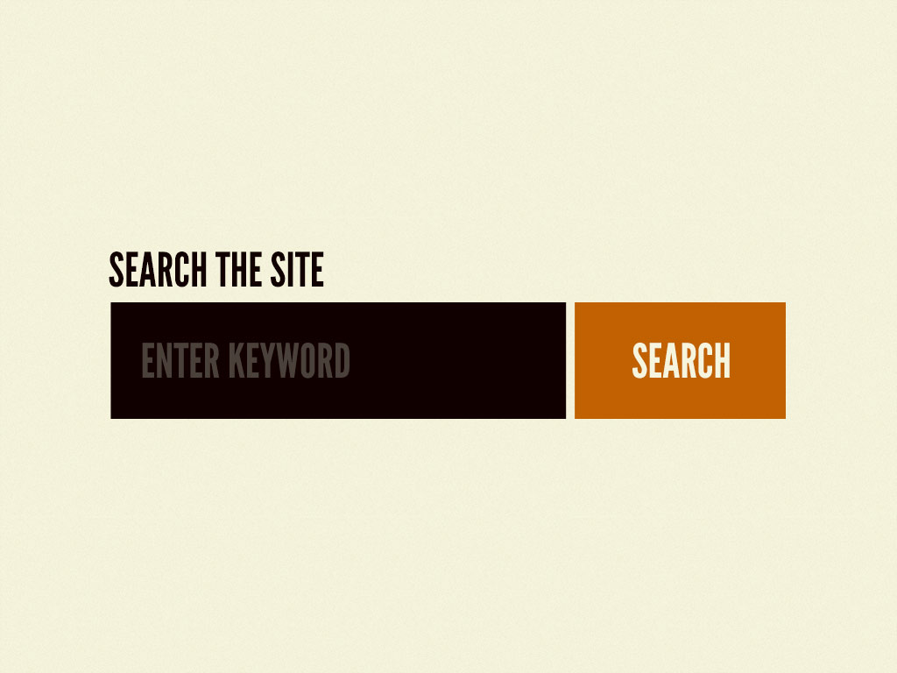
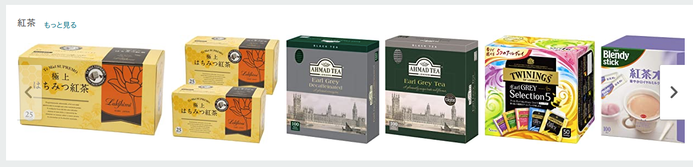

## 記事の目的

[Atomic Design](https://atomicdesign.bradfrost.com/) の記事を読み、実際に適用した際に感じた課題に対して考察を深めた回答を作成している.

後日、自分の振り返りを行う際の参考資料としても用いる目的があります.

## 定義

当記事で取り扱う [Atomic Design](https://atomicdesign.bradfrost.com/) は、参考資料に挙げている https://atomicdesign.bradfrost.com/ で指している考えのことである.

## Atomic Design から読み考えた私見

[Atomic Design](https://atomicdesign.bradfrost.com/) から構想を受け実践し落とし込んだ考えは以下の一言で表現した.

「プロダクトの知識を保有する量に基づいて粒度が変わっていく設計手法である.」

## Atomic Design は何を解決するためのものか

「Atomic Design」は、紙をモチーフとした Web ページの設計からスタートし、ディスプレイのサイズに従ったデザインへ組む必要があったため生まれてきた考え方だと思われる.

肥大化していく要望、ディスプレイの種類に応えるため、単一のページとしてではなく、部品の単位で UI を構築していく必要があった.

単一のページを部品として切り刻んでいく中、部品間でもデザインや共通認識としての一貫性が必要になった.

それらを分類、整理するための仕組みとしての Design System が必要になった.

分類、整理するための方法として導出された階層化を主とした管理方法が「Atomic Design」に繋がっていったと私は捉えた.

[Brad Frost](https://twitter.com/brad_frost) 氏が提供している [Atomic Design](https://atomicdesign.bradfrost.com/) を元に解決しようとしているものを追っていく.

[序文](https://atomicdesign.bradfrost.com/foreword/)

```
And we lit up: this was a shift in perspective, a way to move away from conceiving a website design as a collection of static page templates, and instead as a dynamic system of adaptable components.
```

[Designing Systems](https://atomicdesign.bradfrost.com/chapter-1/)

```
“How are we ever going to redesign this university website that contains over 30,000 pages?!”
```

[Tearing-up-the-page](https://atomicdesign.bradfrost.com/chapter-1/#tearing-up-the-page)

```
To address this reality while maintaining our sanity, it’s absolutely necessary for us to take a step back and break these giant responsibilities into smaller, more manageable chunks.
```

[Atomic Design](https://atomicdesign.bradfrost.com/) の中で言及されている Web ページにおける課題は以下の 3 つにまとめられる.

**課題**

```
1. ディスプレイの大きさが異なる端末が、流通し、その大きさに対応する Web ページを構築する必要性がでてきた.
2. 情報の配信方法が、文書のみから画像、映像、音声その他といったコンテンツを含む配信へ変わっていった.
3. 肥大化する要望に対して迅速に応える必要があった.
```

**アプローチ**

**> 1. ディスプレイの大きさが異なる端末が、流通し、その大きさに対応する Web ページを構築する必要性がでてきた.**

```
ディスプレイの種類が増加するにつれて 1 対 1 の関係でディスプレイのサイズに対応するページレイアウトを作ることが困難になっていた.
Web ページを表示する端末が PC・ディスプレイを飛び出して、手元で操作する携帯電話のディスプレイのサイズを始めとして大中小様々なディスプレイが登場するようになった.
ページ単位として捉えていた設計を、パーツ単位で組み合わせていく設計へ転換していくようになった.
```

**> 2. 情報の配信方法が、文書のみから画像、映像、音声その他といったコンテンツを含む配信へ変わっていった.**

```
既存のメタファーとしてページをイメージしてWebサイトが構築されていたが、要望は上回る速度で多岐に肥大化をしていくようになった.
ページとしてのイメージに沿わないようになりその受け皿のメタファーとして「レゴブロック」が使われるようになった.
```

**> 3. 肥大化する要望に対して迅速に応える必要があった.**

```
肥大化する要望に対して正気を保ちながら対処するため、大きい責任をより小さく分割していくことを避けることができなくなった.
具体的な対応として、モジュール化、スタイルガイドの定義、デザインパターン化という方法が取られた.
```

## Atomic Design で行う課題へのアプローチ


> https://atomicdesign.bradfrost.com/chapter-2/#the-atomic-design-methodology より引用

Atomic Design は、5 つの区分で分かれている.

右へ区分が進むにつれてプロダクトの知識の量が多く含まれていくようになる.
抽象的なモジュールから具体的なモジュールへと具現化している.

### Atoms


> https://atomicdesign.bradfrost.com/chapter-2/#atoms より引用

これ以上分解できないフォームラベル、入力、ボタンなどの HTML の要素が該当する区分.

特徴を項目で挙げると以下であると捉えている.

- 特定のプロダクトの知識を保有しない.
- UI としての知識/機能しか持たない.

```
These atoms include basic HTML elements like form labels, inputs, buttons, and others that can’t be broken down any further without ceasing to be functional.
```

以下 [Atomic Design](https://atomicdesign.bradfrost.com/)で言及している例示を用いる.



> https://atomicdesign.bradfrost.com/chapter-2/#atoms より引用

ここで登場しているボタンやフォームなどは、サービスに沿って定義されたデザインに沿ったものとなっている.
そのため、どのようなプロダクトにも利用できるようになっている.

**留意するべき点は、そのボタンやフォームなどは何に使われるものなのかは知らないという点である.**

サービス全体で、ログインボタンとして扱われることも、気になるユーザーをフォローする場合のボタンとして扱われることもある.
しかし、それはボタンやフォーム自身は知ることはなく、右へ区分が進むにつれてどのプロダクトの知識を表現する要素としての役割が決定するようになる.

例: React Native Elements

> https://reactnativeelements.com/docs/button

### Molecules


> https://atomicdesign.bradfrost.com/chapter-2/#molecules より引用

いくつかの「Atoms」の組み合わせで構成されている区分であるが、これ単体では **成立しない** という区分である.

特徴を項目で挙げると以下であると捉えている.

- 特定のプロダクトの知識を保有しない.
- 複数のコンポーネントの組み合わせで構成されるような Web UI の知識を持つ.
- ある程度の複雑性をもつが、これ単体では成立しない.

```
In interfaces, molecules are relatively simple groups of UI elements functioning together as a unit.
```

以下 [Atomic Design](https://atomicdesign.bradfrost.com/)で言及している例示を用いる.



> https://atomicdesign.bradfrost.com/chapter-2/#molecules より引用

ここで言及されているのは、どういうプロダクトで使用される検索フォームなのかまでは特定できないということ.
特定のユーザーを検索したい時に使いたいのか、EC サイトの商品検索で扱いたいのか. 特定する情報はこの区分では保有しない.

検索フォームのオートコンプリートを持たせる複雑性があってもどの場所で使われるというところは絞り込むことはできない.

この抽象度を維持することで、流用や再利用性を高めることができる.

### Organisms


> https://atomicdesign.bradfrost.com/chapter-2/#organisms より引用

いくつかの「Atoms」、「Molecules」、「Organisms」の組み合わせで構成されている区分である.

特徴を項目で挙げると以下であると捉えている.

- 特定のプロダクトの知識を保有する.
- 単体でサービスに存在できる.

```
Organisms are relatively complex UI components composed of groups of molecules and/or atoms and/or other organisms. These organisms form distinct sections of an interface.
```


> https://atomicdesign.bradfrost.com/chapter-2/#organisms より引用

ここで言及されているのは、サイト内検索をヘッダーに設計する場合である.
役割を決定づけることができるようになり、独立して利用できるようになっている.
Web API をコールさせても問題ない.

しかし、特定のプロダクトの知識を保有するため、他に流用することができなくなる.

下記の例示では、EC サイトの商品情報を出力するための「organisms」を使用している.
この「organisms」でユーザー情報を出力するといったことは行わない.



> https://www.amazon.co.jp/ より引用

## 参考資料

> https://twitter.com/brad_frost

> https://atomicdesign.bradfrost.com/

> https://github.com/bradfrost/atomic-design/

> https://reactnativeelements.com/
