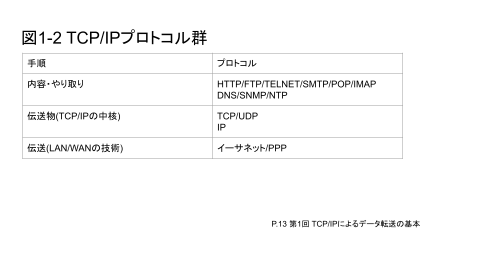
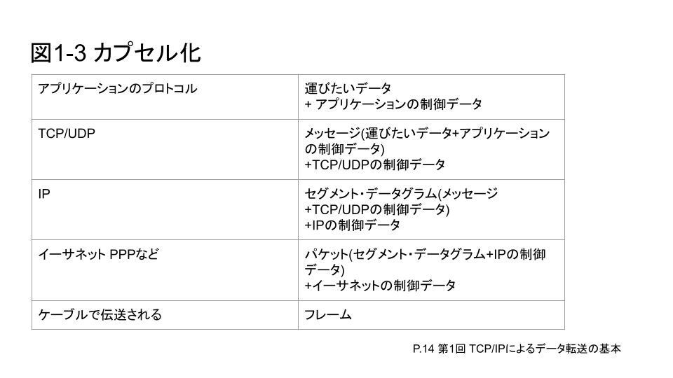
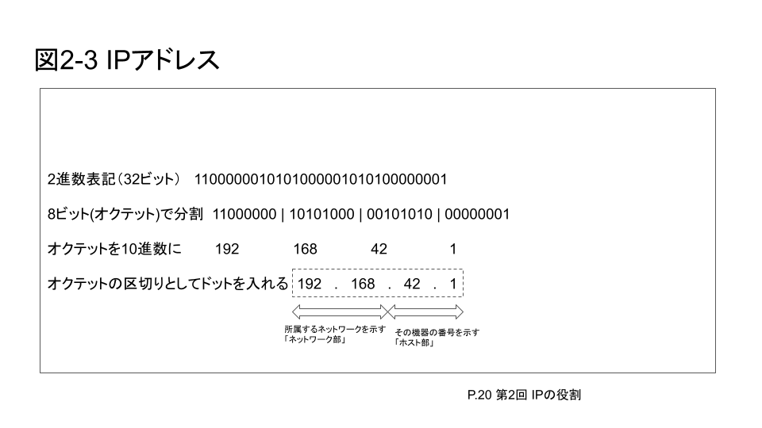

## 記事の目的

TCP/IP について調査した学習過程を収集し、考察を重ねることによって今後の開発でのネットワーク分野の参照資料とする.

## 定義

当記事で取り扱う TCP/IP とは、ネットワークで使用する語句を指す.

## TCP/IP に対する課題

ネットワークに対してのモデリングとそこで使用される語句に対するイメージが貧弱であるためそのイメージを強固なものにする必要があった.

## 内容

通信には、手順とその手順のルールが存在する

1. 内容 (例) 手紙の内容を考えて表現すること
2. やり取り (例) 手紙を交互に出し合うこと
3. 転送物 (例) 封筒に入れて、宛名を書くこと
4. 伝送 (例) 宛先まで運ぶこと

ルールと役割

1. 内容: 情報を整理して記述すること
2. やり取り: 記述した成果物を相手に送って返事を待つこと
3. 伝送物: 送り先までの道筋を記載し、内容が壊れないようにすること
4. 伝送; 実際に道筋を進んで相手に情報を渡すこと

このようなルールをプロトコルと表現している.
デファクトスタンダードとして TCP/IP を用いている.その集まりをプロトコル群とも呼称している.
通信では、段階に応じて、一つではなく複数のプロトコルを使用していく.
転送データに対してプロトコルごとに必要なヘッダを追加していくことをカプセル化と呼ぶ.
ヘッダには、そのプロトコルで行われる制御に必要なデータが書かれている.

ネットワークモデル


> 網野衛二,"3 分間 DNS 基礎講座",13,2009. より引用



> 網野衛二,"3 分間 DNS 基礎講座",14,2009. より引用

IP の役割

IP の役割としては、データの転送を担っている.

ルーティングは、宛先のネットワークまでの経路をルータを利用して決定、送信している.
ネットワークとホストの番号からなる 32 ビットの値

IP ヘッダは以下の表で構成されている.

| 番号 | 名前                   | ビット | 説明                                           |
| ---- | ---------------------- | ------ | ---------------------------------------------- |
| 1    | バージョン             | 4      | IP のバージョン                                |
| 2    | ヘッダ長               | 4      | IP ヘッダの長さ                                |
| 3    | サービスタイプ         | 8      | データグラムの優先度/重要度                    |
| 4    | データ長               | 16     | IP ヘッダとペイロードを合わせた長さ            |
| 5    | ID                     | 16     | データグラムの識別番号                         |
| 6    | フラグ                 | 3      | データグラムを分割しているかどうかの判別       |
| 7    | フラグメントオフセット | 13     | 分割した場合、元に戻す際に使う                 |
| 8    | TTL                    | 8      | ルーティングで使用されるデータグラムの生存時間 |
| 9    | プロトコル             | 8      | 上位プロトコルの指定                           |
| 10   | ヘッダチェックサム     | 16     | IP ヘッダのエラーチェック用コード              |
| 11   | 送信元 IP アドレス     | 32     | 送信元の論理アドレス                           |
| 12   | 宛先 IP アドレス       | 32     | 宛先の論理アドレス                             |
| (13) | オプション             | n      | 特別な設定をする際に使う/ なくてもよい         |

> 網野衛二,"3 分間 DNS 基礎講座",17,2009. より引用

IP アドレスは、ネットワーク部とホスト部からなる 32 ビットの値で、機器を特定してルーティングによって届ける.

ネットワーク部の大きさを表現する方法としてプレフィックス長を使用する.

```
172.16.4.1/22 <- IP アドレスの後ろにネットワーク部のビット数を記述
```



> 網野衛二,"3 分間 DNS 基礎講座",20,2009. より引用

同じ IP アドレスがあるとどの機器を指しているのか判断ができなくなる.
IP アドレスを管理する団体である[ICAN](https://www.icann.org/)がいる.
ニュアンスとしては、IP アドレスの発行を調整して競合を防ぐのが目的の一つとのこと.

この団体の下部組織が割り振る IP アドレスをグローバルアドレスと呼ぶ
組織で自由にアドレスを利用する場合は、[RFC1918](https://www.ietf.org/rfc/rfc1918.txt)で規定された範囲に従うこと.

組織内ではプライベートアドレスを利用してネットワークに接続するときに、[NAT](https://www.ietf.org/rfc/rfc5389.txt)を利用してアドレスの変換を行っている.

## 参考資料/URL

- 網野衛二. 3 分間 DNS 基礎講座,株式会社技術評論社,2009,978-4-7741-3863-3.
- https://www.icann.org/
- https://www.ietf.org/rfc/rfc1918.txt
- https://www.nic.ad.jp/ja/translation/rfc/1918.html
- https://www.ietf.org/rfc/rfc5389.txt
