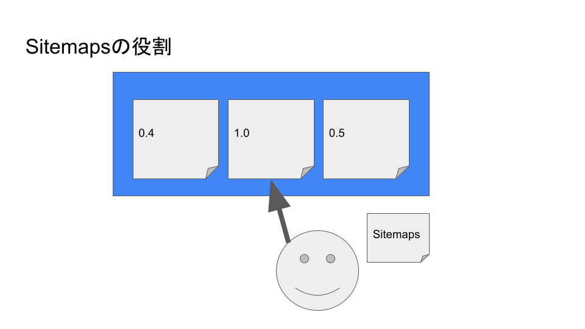

## 記事の目的  
Webサイトを運用するにあたって「Sitemaps」の利用について考える必要が出てきました。  
当時の私自身は、「Sitemaps」がWebサイト上でどのような役割を果たすのかを把握していませんでした。  
この機会に改めて調査、考察を重ねて「Sitemaps」について理解したことを文章化することにしました。  

## 課題  
課題を再整理して以下に記載をしました。  
- 「Sitemaps」についての概要を掴んでいないこと。  
- 「Sitemaps」がどのように利用されているのかを掴んでいないこと。   
- Webサイトの運営で必要なものなのかを判断する情報を掴んでいないこと。  

## 調査と考察  
> 「Sitemaps」についての概要を掴んでいないこと。

Sitemaps自体について調査をしました。  

> "Sitemaps are an easy way for webmasters to inform search engines about pages on their sites that are available for crawling."  

引用：sitemaps.org.*"What are Sitemaps?"*.2020-04-17.https://www.sitemaps.org, 2022-04-29  

「Sitemaps」とは、検索エンジンへWebサイト内のどれが重要なページなのかをメタデータとして渡す仕組みです。検索エンジンは渡されたメタデータを補足情報として用います。これにより適切にクロールできるように利用しています。  
Google,Yahoo!,Microsoftからサポートを含めて広く採用しています。  
最初のページを読むと、以上の情報を拾い上げることができました。 そこから深掘りをしていきます。  

「Sitemaps」は、Webサイト側から検索エンジンに対して自分のサイトのどのページが重要なページなのかを更新頻度を添えて伝えることにより検索エンジンのクロールの効率化を図るものでした。  

   
この仕組みがあるので以下のことを実現するために検索エンジンへ伝えることができます。  
重要度を「0.0」-「1.0」の範囲で表現することができます。  
Topページを「1.0」と設定し、他のページを「1.0」未満に設定します。  

「contact」を0.3

上記の設定を施すことでTopページを検索エンジンに重要度を伝えることができます。  

contactよりもTopを優先して表示するよう依頼することができます。

これにより訪問者がサイト内のTopページを閲覧する可能性を上げることができます。  

更新頻度の高いページを伝えることができるので、主力商品や企業の広報情報のページをサイト内の他のページより上位に表示する可能性を上げることができます。  

Topページよりも更新されるコンテンツを見て欲しいという意図を検索エンジンに伝えることができます。  

しかし、あくまでも検索エンジンのクロールの効率化を図る補助的なものであり、決定づけるものではありません。  

検索ページの上位ではなく、検索ページで該当した際のページが「Topページ」になる可能性を上げるものであり確定するものではありません。

最終的に他の影響を加味して検索エンジンのアルゴリズムに従って検索結果を表示します。  

### どのタイミングで活躍するものなのか

小規模のWebサイトは、Webページが少ないので、利便性は薄いものになります。  

2-5ページ程度なら重要度を設定したとしても検索エンジンは全部目を通してしまうことができるからです。  

恩恵を受けることができるのは、商品単位でページを抱える通販サイトなどが挙げられます。  

(例)  
季節毎にシーズン物の商品の重要度を変更して検索エンジンに伝えることができます。  

通販サイト側で訪問者へ有力な商品のPRとして利用したりすることが可能です。  

または、商品ページよりも重要度を重く置くことで商品の検索ページを上位に配置する運用も視野に入ります。  

優先の濃淡を付けて検索エンジンに伝えることは有用であると判断できます。  

### 調査を踏まえた所感  
最初、私自身は「Sitemap」とは、検索エンジンの検索結果のページランキングに対して影響を与えるものだと捉えていました。  

正しくは、Webサイト上のページの比較を行なうメタ情報を検索エンジンに伝えてどのページが重要なのかを伝えるものでした。  

### 「Sitemaps」の定義方法  
「Sitemaps」は以下のルールに従って構成します。  

- XMLタグであること。  
- UTF-8でエンコードされていること。  
- 開始タグで始まり、終了タグで終わること。  
- `<urlset>` タグ内で名前空間を指定すること。  
- 親 XML タグとして、各 URL のエントリを含めていること。  
- 各親タグの子エントリを含めていること。  

以上のルールに則ったサンプルコードは下記となります。 

```xml{numberLines: true}:title=single.xml
<?xml version="1.0" encoding="UTF-8"?>
<urlset xmlns="http://www.sitemaps.org/schemas/sitemap/0.9">
   <url>
      <loc>http://www.example.com/</loc>
      <lastmod>2005-01-01</lastmod>
      <changefreq>monthly</changefreq>
      <priority>0.8</priority>
   </url>
   <url>
      <loc>http://www.example.com/catalog?item=12&amp;desc=vacation_hawaii</loc>
      <changefreq>weekly</changefreq>
   </url>
   <url>
      <loc>http://www.example.com/catalog?item=73&amp;desc=vacation_new_zealand</loc>
      <lastmod>2004-12-23</lastmod>
      <changefreq>weekly</changefreq>
   </url>
   <url>
      <loc>http://www.example.com/catalog?item=74&amp;desc=vacation_newfoundland</loc>
      <lastmod>2004-12-23T18:00:15+00:00</lastmod>
      <priority>0.3</priority>
   </url>
   <url>
      <loc>http://www.example.com/catalog?item=83&amp;desc=vacation_usa</loc>
      <lastmod>2004-11-23</lastmod>
   </url>
</urlset>
```
引用：sitemaps.org.*"Sitemaps XML format"*.2016-11-21.https://www.sitemaps.org/protocol.html, 2022-04-29 

それぞれのセクションをまとめると以下の表になります。

| 属性 | 必須 | 説明|
| ---| --- | --- |
| `<urlset>` | ○ | ファイルの他のタグを囲む|
| `<url>`| ○ | 各URLエントリの親タグであり他のタグ内に含めた|
| `<loc>`| ○ | ページの URL|
| `<lastmod>` | - | ファイルの最終更新日(YYYY-MM-DD)|
| `<changefreq>` | - | always/hourly/daily/weekly/monthly/yearly/never|
| `<priority>`| - | サイト内の他のURLと比較したこのURLの優先度(0.0 - 1.0) デフォルトは、0.5 |

全てのページのURLを載せる必要はありません。  
URLを含めない場合は、0.5として他のページの優先度と比較することになります。  

運用を続けていくうえで、50,000ページを超えるようになった場合は、以下のサンプルのようにindex用のファイルを作成することできます。入れ子として「Sitemap」を指定することができます。  
入れ子になっている「Sitemap」は圧縮を行うことでサイズダウンを図ることできます。  

```xml{numberLines: true}:title=multiple.xml
<?xml version="1.0" encoding="UTF-8"?>
<sitemapindex xmlns="http://www.sitemaps.org/schemas/sitemap/0.9">
   <sitemap>
      <loc>http://www.example.com/sitemap1.xml.gz</loc>
      <lastmod>2004-10-01T18:23:17+00:00</lastmod>
   </sitemap>
   <sitemap>
      <loc>http://www.example.com/sitemap2.xml.gz</loc>
      <lastmod>2005-01-01</lastmod>
   </sitemap>
</sitemapindex>
```
引用：sitemaps.org.*"Sitemaps XML format"*.2016-11-21.https://www.sitemaps.org/protocol.html, 2022-04-29 

| 属性 | 必須 | 説明|
| ---| --- | --- |
| `<sitemapindex>` | ○ | 全てのSitemapをこのタグの入れ子のタグとして定義します|
| `<sitemap>`| ○ | 個々のSitemapを定義します|
| `<loc>`| ○ | Sitemapを配置しているリソース Sitemap,Atom,RSS,text等を指定可能|
| `<lastmod>`| - | Sitemapの変更時間　W3C Datetime|

`<lastmod>`はSitemapの変更された時間を定義することで、検索エンジンが特定の日以降の変更されたSitemapを読み込みます。  
この仕組みにより大規模なサイトで新しく作成、更新したページをクロールすることができます。  

#### XML以外の場合  
RSS2.0,Atom3.0,feed1.0,テキストファイルでも提供可能

| 属性 | 必須 | 説明|
| ---| --- | --- |
| `<link>` | ○ | URL |
| 変更日| - | RSS,Atomでタグの定義は異なる|

テキストファイル
- 1行に1つのURLであり埋め込みの改行を含めないこと。
- URLは絶対表記していること。
- テキストファイルも分割することができること。
- UTF-8でエンコーディングしていること。
- ヘッダー、フッターを含まないこと。
- 任意の名前を付けることが可能
ルールは以下を参考にすること
https://www.ietf.org/rfc/rfc3986.txt
https://www.ietf.org/rfc/rfc3987.txt

以下はサンプルです。

```
http://www.example.com/catalog?item=1 http://www.example.com/catalog?item=11
```

### 検索エンジンへの通知方法  

robots.txtをWebサイトの直下に置いて検索エンジンはこのファイルから読み取りクロールする対象を決定します。  

http://www.robotstxt.org/
https://developers.google.com/search/docs/crawling-indexing/sitemaps/build-sitemap
https://www.mozilla.org/sitemap.xml

### 検索エンジンの対応

> "Las Vegas, November 16, 2006 – In the first joint and open initiative to improve the Web crawl process for search engines, Google, Yahoo! and Microsoft today announced support for Sitemaps 0.90 (www.sitemaps.org), a free and easy way for webmasters to notify search engines about their websites and be indexed more comprehensively and efficiently, resulting in better representation in search indices."

引用：google.com.*"Major Search Engines Unite to Support a Common Mechanism for Website Submission"*.2006-11-16.https://googlepress.blogspot.com/2006/11/major-search-engines-unite-to-support_16.html, 2022-04-29 

Google は利用者が多いと想定されるので、提供されている資料に目を通す価値は大きいと思います。

#### Googleが参考にしない項目

`<priority>` と `<changefreq>`は参考にしないです。

## 参考資料

- "What are Sitemaps?": https://www.sitemaps.org/
- https://developers.google.com/search/docs/advanced/sitemaps/overview
- https://googlepress.blogspot.com/2006/11/major-search-engines-unite-to-support_16.html
- https://www.sitemaps.org/schemas/sitemap/0.9/sitemap.xsd
- https://www.sitemaps.org/schemas/sitemap/0.9/siteindex.xsd